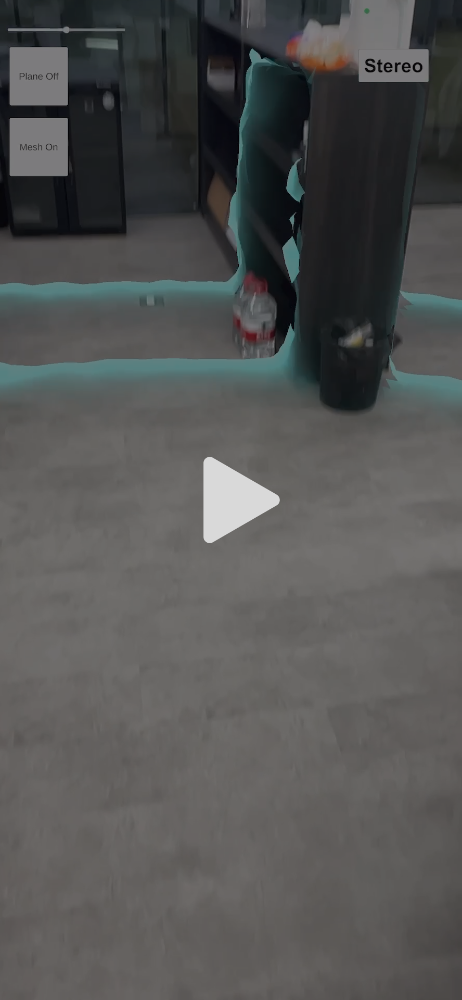
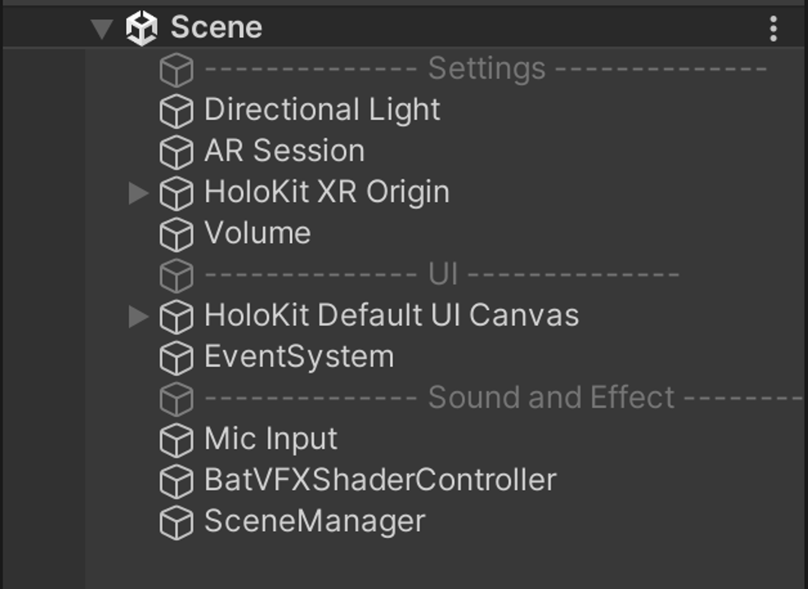
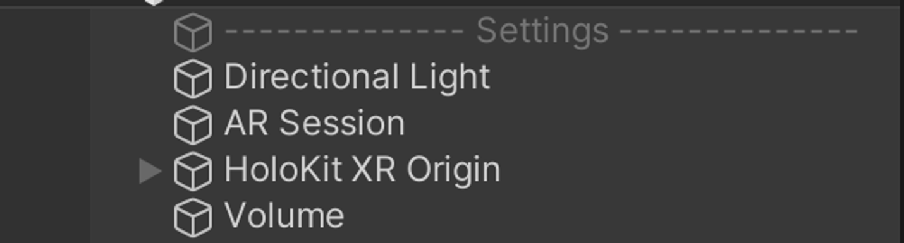
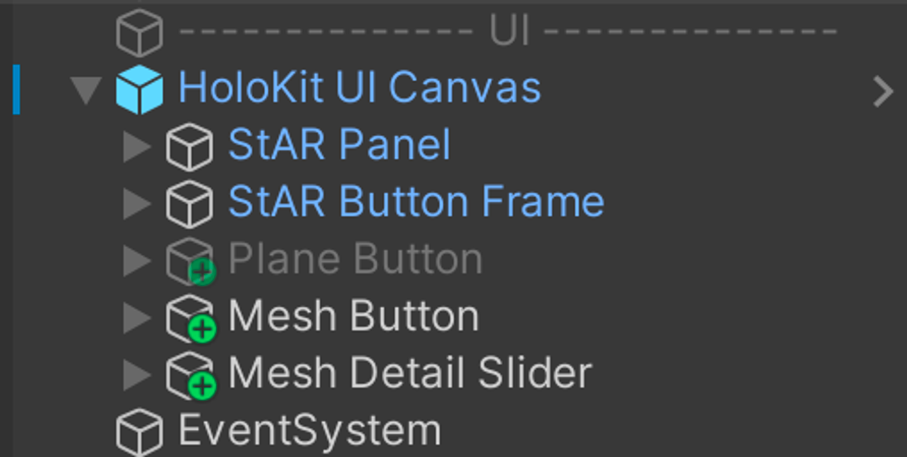

# becoming-bats

This project features a sample that demonstrates using voice as input to activate position-related spatial visual effects within an AR scene. Inspired by how bats detect their surroundings with their own sound.

## What is becoming-bats

The "becoming-bats" project utilizes the meshing functionality of AR Foundation. This meshing feature provides environmental model information, allowing us to overlay visual effects on the physical environment to convey a specific theme.

The project is positioned as an AR interactive experience where users can engage through handheld devices or with HoloKit. By emitting sounds (initiating bat echolocation), players experience a diffusion of blue visual effects onto surrounding physical surfaces. This signifies the perception of the environment through the propagation of sound and its collisions within the surroundings.

## How does it work

In this project, we take your voice as input, trigger a visual effect every time you make sound(the volume of sound should be above a pre-set value). And the visual effect is a spatial visual effect which needs mesh information of your surroundings(we use Meshing feature from AR Foundation to get the mesh information).

Our Unity scene consists of three parts: “Settings”, “UI” and “Sound and Effect”:

### Settings

In Settings, we set our main light of scene with a Directional Light object. A Volume to add post-processing effect to our scene. AR Session and XR Origin is basic creating AR experience in Unity.

### UI

In UI, we got a Canvas called HoloKit UI Canvas and An EventSystem Obbect. Inside canvas there are four objects:

First two are default UI for HoloKit usage, we won’t discuss them here. 

The “Mesh Button” object is a button to control On&Off of ARMeshManager feature. if you always keep this feature On, meshing feature will kill the performance of your phone. Here the button on your own hands, you can disable this feature when you got enough mesh information of your surroundings.

The”Mesh Detail Slider” is a slider object used to control the level of detail of your mesh. A higher value means a more detailed mesh, resulting in a smoother and better matching between meshing information and real environment

### Sound and Effect

In “Sound and Effect”, “Mic Input” object detects all the voice input of your device, if the volume is beyond the pre-set value, it will trigger a event, which in this case is to make a visual effect from your current position.

The “BatVFXShaderController” objects grab some parameters and pass them to our visual effect. Our visual effect is made with ShaderGraph, relates to current position, needs an awareness of current position and trigger time to create a time-varying visual effect.

Finally, “SceneManager” object provides some functions for our UI elements. UI itself is a button, slider or sth else with no function in it. We create those functions and bind them to UI elements. Such as a function controls the On&Off of ARMeshManager.

## Requirements

This project aims to build an app runs on iOS device.

1. Unity 2022.3.8f1
2. Xcode 14.2
3. iPhone with lidar capability

## How to use

1. Clone the project, open with Unity
2. Open Assets -> BatSound -> Scene
3. Build this scene to an Xcode project
4. Open Xcode, build app to your mobile device
